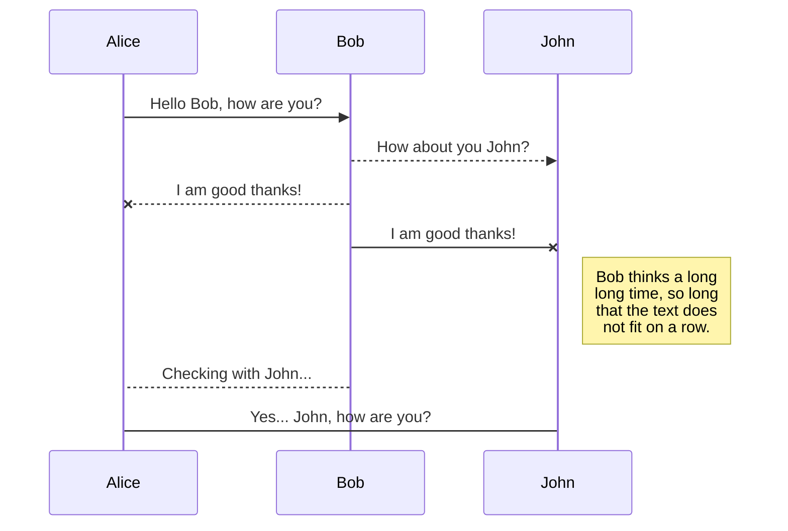
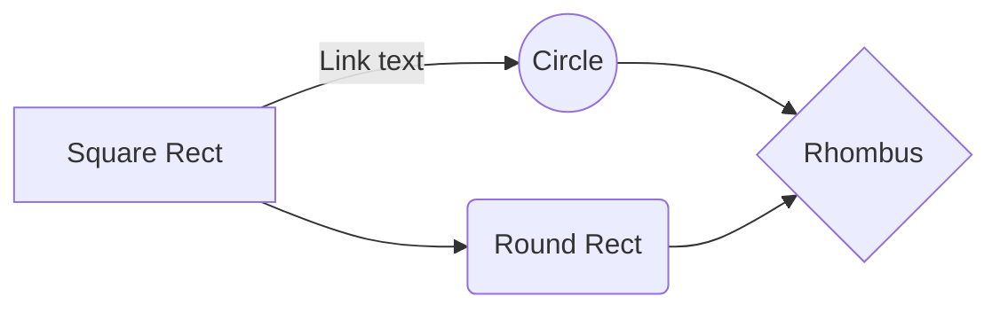

<br>
# The Football Report
This is website is part of the the Code Institute Full Stack Software Development course.. and is the final project of the course. It is the fourth project along the leaning curve and aimed to complete the course. The project represents a football newspaper site which allow page visitors to read a sample of free articles. If visitor register can have full access to the entire website articles. The next level of user experience an user subsription functionality which employ also the business logic of the project. By subscribing the user can  become an author by publishing an article with media. The subscription plan resembles a contribution that help the founders of the website to maintain and host the service.

<hr>

The purpose of project is purely for educational usage although it provides readings that I personally wrote throught my hobby as freelance football writre. The payment system module is build with the test version of Stripe and it is for testing only. It does not process real payments. Tests of the payment can be performed with credit card number 4242 4242 4242 4242. Please visit https://stripe.com/docs/testing to find more about the test card details.


## Table of Contents

1.  [**User Experience**](#user-experience)
-  [**Project Goals**](#project-goals)
-  [**User Goals**](#user-goals)
-  [**User Stories**](#user-stories)
-  [**Design**](#design)
-  [**Wireframes**](#wireframes)

  
2.  [**Features**](#features)
-  [**Existing Features**](#existing-features)
-  [**Future Features**](#future-features)
3.  [**Database Schema**](#database)
4.  [**Technologies Used**](#technologies-used)
5.  [**Testing**](#testing)
6.  [**Coding Notes**](#coding-notes)
7.  [**Deployment**](#deployment)
8.  [**Acknowledgements**](#acknowledgements)
9.  [**Disclaimer**](#disclaimer)


# User Experience

All your files and folders are presented as a tree in the file explorer. 
You can switch from one to another by clicking a file in the tree.

## Project Goals

The project purpose is to build a Full Stack webiste to present the complete learning 
outcomes of the course. 
The project is submitte for evaluation and entails a pass grade to graduate with 
universite certified diploma. The website backend is built with Django Framework and Python and thanks to Django has backend database (SQLite). 

The website represents a football platform for analisys and creative writiting 
for author. Page visitors can read the sample of articles available. 
To access the full list of articles users have to registered which automatically 
create a profile page. Registered user can extend their experiece by writing 
and publishing their ownn articles. To publish an article needs to buy a 
subscription framed as a contribution purpose to keep the website going and 
paying for costs of hosting. The subscription logic uses small amounts to 
support the community support framing. To facilitate the e-commerce logic 
I will install Stripe which is payment processing software. 

### Target customers

People who love football as a sport and social event
People who like writing.
Freelance journalists


### User Access

This website aims to provide the following:

1. Allow users to visit the page and have access to the sampled articles and media without being registered.
2. Non-registered users can view the about page, motivation page, landing page and pricing page. 
3. Provide users with signup option
4. After registration users has access to to the full webpage content
5. User have their own profile page with a default picture setup.
6. After logged in users are able to pick subscription plan, add it to their shopping card and submit a payment to become authors and publish their own articles.
7. Users have access to shorlist with their own articles and subscripton history in the profile page
8. After becoming authors, user are provided with option ot update and delete only their own aritcles.


### User Stories

Non-registered users:

1. As a non-logged in user I want to see the landing page media and browse over the sample articles provided in the carousel slider.
2. As a non-logged user I wish to find more about the philosophy behind the website, check the pricing plans.
3. As non-logged in user I can either signup or login to the page if I already have an account.

Registered users:

1. To able to login and logout from the website
2. After registration I can access my profile page with basic profile info and auto added profile image.
3. After registration I can read all the article reports published in access new articles reports after pubslished.
4. In the articles list can view the article card with date published, name of the author and article image thumbnail.
5. I want articles shown per page to be limited to 3 and rest of the articles list be accessed with a pagination.
6. The article card in the article list has to provide user with links ot view the full article page by clickig either the title or the image thumbnail.
7. Article detailed page should present the full article picture, date published with author info, and the entire text of the article
8. After registration I can choose a subscribtion plan to publish my own articles.
9. After choosing the subscription plan I would like to see the chosen subscriptio plan in a shooping card with a option to remove or proceed to checkout page. 
10. If the subscription is removed  users can return back to the homepage.
11. Users can proceed to the checkout page where they should view the subscription plan details.
12. In the checkout page user can submit theire payment details
13. Users can see once again the price of the subsription and the amout theire cart will be charged.
14. Once in the checkout the user needs to have the option button to return to the shopping cart page and adjust it.
15. To be able to complete the purchase for the subscription plan directly to site with a valid credit card details 

Subcription Users:

1. After a successfull payment there I can view the subscription added to a subscription history in my profile page
2. After successfull payment users can see the button for publishing articles in their profile page.
3. In publish article page users can add title, photo and text content to the article.
4. In the publish article users can check their text and add additional content using the rich text editor.
5. If users forget to provide article picture the website provides default picture themed according to the website design.
6. After clicking the publish article button I can check and see the article published in the reports page.
7. After publishing the article I can see it also in the list with published articles in my profile page.
8. In the reports page I can access and read both my articles and other user articles.
9.  If I choose to read and article which I authored then I can update and delete the article, but only if I am the author.
10. In the update view of the page I can change the title, picture and text of the article.
11. In the delete view I am asked to confirm the removal or cancel the removal. 


## Design

### Wireframes

WIrefames serve as the blueprints of the website design. Wireframe are added 
\thanks to [https://balsamiq.com/](https://balsamiq.com/) tool recommended by 
the Code Institute. The blue prints and can be found in the [/documentation]() 
folder at []() . As I was changing the project and style idea much before I 
choose this project all my blueprints were done on hand wiht pencil and paper 
and added after the page was coming though. During the proframming the style 
remaind the same with little changes, Some of the page desings were simplified 
in the final design changes to utilise space and better user interface on mobile.

### Responsive Design

The webisite is based on the Bootstrap front-end-framework availabel at[  
getbootstrap.com](https://getbootstrap.com/). 
Such framework allows to implement key design features and keep the them 
responsive on different screen sizes and mobile view. 
I used Firefox and Chrome for the programming part where the design 
stacked well eventually after constatly checking the devtools. 
The website is responsive on other browsers like Safari, Edge and Opera. 
It stack well mobile screens ranging between 320x568 to 414x736 
where the navigation bar shring to a hamburger dropdown menu .

### Colours

 ***#000***
 ***#a8a9ad*** 
 ***#f1f1f1***  
At the start of the project I used the defaul pure white background color for the body, later decided to switch to very light grey to reduce the lightning of the page and better visual relaxation for the user. The styling of the buttons follows the bootstrap4 color convention for danger, success, secondary and so forth.


###  Fonts and Icons

My choice for the 'Inter' (https://fonts.google.com/specimen/Inter?sidebar.open=true&selection.family=Interstems)
from the idea to be light and and not heavy for reading.
The icons form the Font Awesome library [fontawesome.com](https://fontawesome.com/). 
I tried to use as less as icons as possible in the desing because the website 
is focused and meant as writing platform that resembles a newspaper website. 
Using many icons would perceive the design style as more technical than it 
should be for these website types.


## Features

### Implemented Feautures

1. Landing page with image slide and inspirational video message.
2. Login and signup authnetication functionaliy
3. CRUD model so user can create, retreive, update and delete their Articles
4. User withe registered profiles can chosse subscription and author articles and take advantage fromt the CRUD model.


### Feautures To Implement In the Future

1. A start or score rating under each article 
2. Social media share buttons for the articles

## Database

During the development process the date is stored thanks to the Django builtin SQLite datebase. In the deployment phase the datebase is imported in Postrgres to reach to the production phase via Heroku.

### Datebase Schema

Here is my Database pattern, Thanks to this [advisory article](https://www.freecodecamp.org/news/how-to-create-database-schemas-quickly-and-intuitively-with-dbdesigner-2f4adf79a29d/) I used  https://www.dbdesigner.net/ to generate more clear and visual presentation of the datebase logic. 

<a  href="/documnets/db_schema.png"  target="_blank"></a>

To explain the database pattern I will simply follow the user logic. First the the profile needs to exists in order to attach package. 
To attach the package user needs to get a subscription data model. The subscribtion data model is connected to the package line item with through the Foreign Key.
Once the package is purchase gets attached to the profile through its Foreing Key user. Similarly the packaline item get attached to the packege via its Foreing Key order.

# Technologies Used


To adopt and implemnt the features functuanalities this project employs Python, Django, Postgres, SQLite, HTML, CSS and JavaScript technologies.

-   [Python](https://www.python.org/)  The Django framework project active language  **Python 3.8**  is uded to develop the website.

-   [Unsplash API ](https://unsplash.com/) to generate the random photo gallery for the home page and the about page. The gallery theme is football.

-   [JQuery](https://jquery.com/) to make the video modal working and other responsive features like the navbar hamburger menu.
- 
-   [[CKEditor 5](https://ckeditor.com/ckeditor-5)  The project uses  **CKEditor 5**  as part of the Article model to make the text field better.
    
-   [Bootstrap 4](https://getbootstrap.com/)  to enhance website design responsivess over different screen sizes.
    
-   **HTML 5, CSS3 and JavaScript** are used throughout to improve the website structure and functionality.
    
-   [Google Fonts](https://fonts.google.com/)  to style the fonts.
    
-   [Django](https://www.djangoproject.com/)  The website is build from the  **Django**  framework.
    
-   [SQLite](https://www.sqlite.org/)  comes as built in feature in the Django Framework. It is used during the development phase
    
-   [Postgres](https://www.postgresql.org/)  The project utilizes **Postgres**  relational database to store database in the production phase.
    
-   [StackEdit](https://stackedit.io/)  used for building the readme file
    
-   [Stripe](https://www.stripe.com/)  facilitates the payments direclty from the page, 

-   [GitHub](https://github.com/) is the source code remote repository store the source code in a repository. The repository can be cloned or downloaded from here. Check  [Deployment]()  section

-   [Heroku](https://www.heroku.com) is used to host the project and make it available online with a original url.

-   [Amazon Web Services](https://aws.amazon.com/education/awseducate/) it comes after the delployment phase with Heroku. Hosting the website from Amazon Web Services' cloud is the last step of the deployment phase and brings the project in the production phase.

 ## Testing

The entire development process was had time contstraints and meeting deadlines. Hence I tested every new piece of code thourougly. 
When the submission version I perform some automated unit test and then a performance test report with the lighthouse feature in devtools for chrome.

### Automated Testing

Unit Test

| App Tested    | Test Info     | File Location | 
| ------------- | ------------- | --------------| 
| blog  | Testing the homepage view | blog/test_views.py  |
| blog |  Testing showing the articles list  | blog/test_views.py  |
| blog  | Testing click and view single article from the article list | blog/test_views.py  |
| blog  | Testing update  functuanalities  | blog/test_views.py  |
| blog  | Testing create new article functuanality  | blog/test_views.py  |
| blog  | Testing delete existing article functuanality  | blog/test_views.py|
| cart    | Test the login required to load the view_cart template| cart/test_views.py |
| cart    | Tests if the cart renders correctly after login | cart/test_views.py |
| checkout    | Tests if the form is validated correctly after correct user input | checkout/test_forms.py |
| checkout    | Tests if the form gives error feedback in case the user input is incorrect | checkout/test_forms.py  |
| profiles    | Tests if the signup page loads | profiles/test_views.py |
| profiles    | Tests if the login page loads | profiles/test_views.py |
| profiles    | Tests if the logout responds correctly | profiles/test_views.py |


Unit Test

The first report generated form the lighthouse tool showed some average results. After on each circle indicator the tool takes you
to the several points that may be causing the reduced results. Here is the first test tesults

<a  href="/documnets/lighthouse1.PNG"  target="_blank"></a>

Looking into the error I adjusted the width and height of the image in the info section of home.html. 
The second step was to remove redundant some JavaScript code. After this I added missing aria-labels
for all ```<button>``` tags. After this ended up with results which a bit better.

<a  href="/documnets/lighthouse2.PNG"  target="_blank"></a>

While taking into the account the score in the performance indicator I didn't plan to proceed with refactoring further because
the advice in the lighthouse tool indicated to remove the JQuery and some Stripe JavaScript code which is risky.

### Manual Testing

This manual testing phase is comprised by manually checkin consistency between project goals 
and the user stories and check for bugs. While testing the user stories I tried to stick to 
the kanban method to prioritise and not stuck on one of the stories, thus saving time and 
limit bottlenecks. 

| User Story Tested | Result   | Ready     |
| ----------------- | -------- | --------- |
| User can access the landing page | Landing page loads correctly  the slider, video modal, gallery access. Navbar shrinks responsively  | Yes |
| User can access the sample articles from the slider | (Resolved)All visitor can access the free sampled articles from the carousel slider | Yes |
| The page is restricted correctly for non-logged user access the sample articles | (Resolved)User is prompt to login | Yes |
| User can access the about page without being logged in | Page displays withount error and consistently on mobile and desktop  | Yes |
| User cannnot access the articles list without being logged in | When not logged in the user is prompter to login to access the full list of articles. Page displays without error and consistently on mobile and desktop  |  Yes|
|User clearly can see pricing page | The page loads with three price categories and if user click on add to cart leade to login page| Yes |
|User can load the pages for the login and signup | The login and signup pages load with no errors| Yes |
|Signup Page | The sing up page function correctly and sends a link to the verification email to listed email. Email is send in the console for the moment| Yes |
|Login Page| User can login successfully with valid username and password and the page shows a toast message for a successful login. |Yes|
|Sending Emails| No reset password email, no email verification sent | NO |

| Logged In User Story Tested |  Result| Ready |
|--|--|--|
| User can access the reports page when logged in | Reports page loads correctly the pagination active and displaying three articles per page both on mobile and desktop  |  Yes|
|Article List Page |  Eahc article card dispays responsively with thumbnail picture, date and author of the article plus title of the report | Yes
|Access to Article Detailed Page | User can either click on the image or the article title and will be taken to the article detail page | Yes |
|Article Detailed Page | the full article picture, date published with author info, and the entire text of the article |
| User can access the pricing page | Pricing page loads without error and cuser can click on get it to proceed to checkout page |  Yes|
|Cart page | User can see the summary of the chosen subscription with option to proceeds to checkout and remove option available too |
|Remove the Subscription from the Cart | Partner can successfully remove the description before proceeding to checkout (NO BUTTON AVAILABLE TO GO BACK TO SUBSCRIPTIONS | NO |
|Checkout Page | The checkout page loads without error with two colums. In the left column is purchase form details. In the right columns is the subscription summary | Yes |
|Checkout Page Purchase | User can fill out the the form to submit the payment. All fields are required. | Yes |  
|Charges Checkout Page | User can receive the price at three places in the checkout page. It dispays an alert message how much the credit card will be charged right next to the complete purchase button. User can return back and adjust the card too. | Yes |
|Checkout Success Page | After successfull payment the user is redirected to a Payment successfull page with summary of the purchase and the unique ID of the subscription. Confirmation email sent.| Yes |


| Subcribed User Story |  Result| Ready |
|--|--|--|
Profile Page | If there is payment confirmation users with subscription can view their subscription in the order history| Yes |
Profile Page Details | If payment is successfull users now have access to an active button to publish article located in the profile card| Yes |
Publish Article Page | Page load successfully and users can check upload article with a title, picture, text content and add additional text content using the rich text editor.| Yes 
Article List | User can see the article on the top of the list sorted by last date published. PICTURE ISSUE NOT FIXED | NO |
Update and Delete Page | User who authored the article can update all submitted details or remove it. The option is restricted for the authors of the article only | Yes |
Article Delete Confirmation | If user goes for the delete option there is confirmation page with confirm and cancel option. If confirms the user is redirected to the home page. Clicking the cancel button returns the user to the article view page. | Yes |
Logout Page | User can choose to logout where is asked to confirm the sign out intention. If confirmed it redirects to the home page | Yes |


### Bugs & Workarounds


After the first end-to-end testing phase was drafted I identified several issues:

1. User cannot access the samplae articles from the slider page.
    Solution: added small piece of url code simply to specify the argument after the url. 
    ~~~
    <a href="" class="btn btn-info btn-lg">Read Now</a>
    ~~~

    After trying many much more complicated arguments a tutor from Code Institute 
    named Scott deserves the credtit for pointing me in the right direction

2. Non-logged user cannot access the report page - fixed in the testing phase 
    with simple loop which redirect to login page in if user did not pass authnetication

    ~~~
    
            <li class="nav-item">
                <a href="" class="nav-link">Reports</a>
            </li>
    
            <li class="nav-item">
                <a href="" class="nav-link">Reports</a>
            </li>
    
    ~~~
    
3. Emails are sent successfully but only in the console not send outside Django
4. Picture artice doesnot sync well with desktop screen unless is 1100x700
5. Update and delete buttons are shown on every article detail view. Though there 
    is specific funtion in the class base view which block user who is not-an author 
    makes any changes to the page


- The workspace synchronization will sync all your files, folders and settings automatically. This will allow you to fetch your workspace on any other device.
	> To start syncing your workspace, just sign in with Google in the menu.

- The file synchronization will keep one file of the workspace synced with one or multiple files in **Google Drive**, **Dropbox** or **GitHub**.
	> Before starting to sync files, you must link an account in the **Synchronize** sub-menu.


## UML diagrams

You can render UML diagrams using [Mermaid](https://mermaidjs.github.io/). For example, this will produce a sequence diagram:



And this will produce a flow chart:




