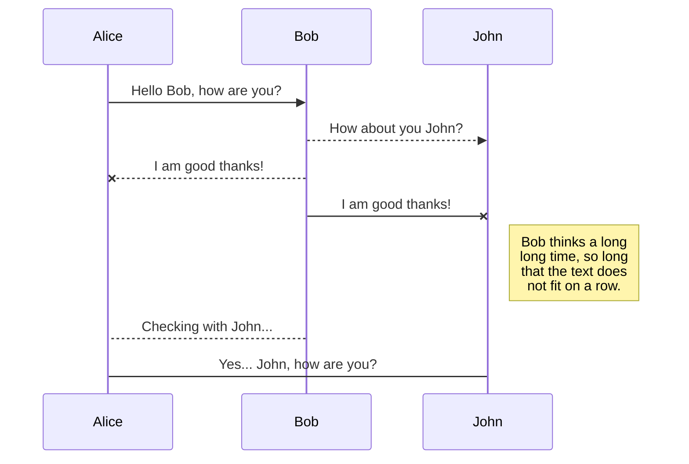
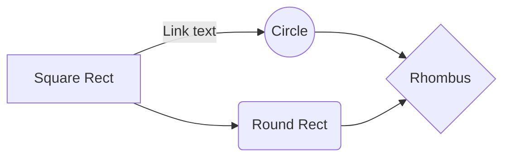

# The Football Report
This is website is part of the the Code Institute Full Stack Software Development course.. and is the final project of the course. It is the fourth project along the leaning curve and aimed to complete the course. The project represents a football newspaper site which allow page visitors to read a sample of free articles. If visitor register can have full access to the entire website articles. The next level of user experience an user subsription functionality which employ also the business logic of the project. By subscribing the user can  become an author by publishing an article with media. The subscription plan resembles a contribution that help the founders of the website to maintain and host the service.

The purpose of project is purely for educational usage although it provides readings that I personally wrote throught my hobby as freelance football writre. The payment system module is build with the test version of Stripe and it is for testing only. It does not process real payments. Tests of the payment can be performed with credit card number 4242 4242 4242 4242. Please visit https://stripe.com/docs/testing to find more about the test card details.

## Table of Contents

1.  [**User Experience**](#ux)
-  [**Project Goals**](#project-goals)
-  [**User Goals**](#user-goals)
-  [**User Stories**](#user-stories)
-  [**Design**](#design)
-  [**Wireframes**](#wireframes)

  
2.  [**Features**](#features)
-  [**Existing Features**](#existing-features)
-  [**Future Features**](#future-features)
3.  [**Database Schema**](#database)
4.  [**Technologies Used**](#technologies-used)
5.  [**Testing**](#testing)
6.  [**Coding Notes**](#coding-notes)
7.  [**Deployment**](#deployment)
8.  [**Acknowledgements**](#acknowledgements)
9.  [**Disclaimer**](#disclaimer)

# The Football Report
This is website is part of the the Code Institute Full Stack Software Development course.. and is the final project of the course. It is the fourth project along the leaning  and aimed to complete the couse. The project represents a football newspaper site which allow page visitors to read a sample of free articles. If visitor register can have full access to the entire website articles. The next level of user experience an user subsription functionality which employ also the business logic of the project. By subscribing the user can  become an author by publishing an article with media. The subscription plan resembles a contribution that help the founders of the website to maintain and host the service.

The purpose of project is purely for educational usage although it provides readings that I personally wrote throught my hobby as freelance football writre. The payment system module is build with the test version of Stripe and it is for testing only. It does not process real payments. Tests of the payment can be performed with credit card number 4242 4242 4242 4242. Please visit https://stripe.com/docs/testing to find more about the test card details.

## Table of Contents

1.  [**User Experience**](#ux)
-  [**Project Goals**](#project-goals)
-  [**User Goals**](#user-goals)
-  [**User Stories**](#user-stories)
-  [**Design**](#design)
-  [**Wireframes**](#wireframes)

  
2.  [**Features**](#features)
-  [**Existing Features**](#existing-features)
-  [**Future Features**](#future-features)
3.  [**Database Schema**](#database)
4.  [**Technologies Used**](#technologies-used)
5.  [**Testing**](#testing)
6.  [**Code Notes**](#coding-notes)
7.  [**Deployment**](#deployment)
8.  [**Acknowledgements**](#acknowledgements)
9.  [**Disclaimer**](#disclaimer)

# User Experience

All your files and folders are presented as a tree in the file explorer. You can switch from one to another by clicking a file in the tree.

## Rename a file

You can rename the current file by clicking the file name in the navigation bar or by clicking the **Rename** button in the file explorer.

## Delete a file

You can delete the current file by clicking the **Remove** button in the file explorer. The file will be moved into the **Trash** folder and automatically deleted after 7 days of inactivity.

## Export a file

You can export the current file by clicking **Export to disk** in the menu. You can choose to export the file as plain Markdown, as HTML using a Handlebars template or as a PDF.

# Synchronization

Synchronization is one of the biggest features of StackEdit. It enables you to synchronize any file in your workspace with other files stored in your **Google Drive**, your **Dropbox** and your **GitHub** accounts. This allows you to keep writing on other devices, collaborate with people you share the file with, integrate easily into your workflow... The synchronization mechanism takes place every minute in the background, downloading, merging, and uploading file modifications.

There are two types of synchronization and they can complement each other:

- The workspace synchronization will sync all your files, folders and settings automatically. This will allow you to fetch your workspace on any other device.
	> To start syncing your workspace, just sign in with Google in the menu.

- The file synchronization will keep one file of the workspace synced with one or multiple files in **Google Drive**, **Dropbox** or **GitHub**.
	> Before starting to sync files, you must link an account in the **Synchronize** sub-menu.

## Open a file

You can open a file from **Google Drive**, **Dropbox** or **GitHub** by opening the **Synchronize** sub-menu and clicking **Open from**. Once opened in the workspace, any modification in the file will be automatically synced.

## Save a file

You can save any file of the workspace to **Google Drive**, **Dropbox** or **GitHub** by opening the **Synchronize** sub-menu and clicking **Save on**. Even if a file in the workspace is already synced, you can save it to another location. StackEdit can sync one file with multiple locations and accounts.

## Synchronize a file

Once your file is linked to a synchronized location, StackEdit will periodically synchronize it by downloading/uploading any modification. A merge will be performed if necessary and conflicts will be resolved.

If you just have modified your file and you want to force syncing, click the **Synchronize now** button in the navigation bar.

> **Note:** The **Synchronize now** button is disabled if you have no file to synchronize.

## Manage file synchronization

Since one file can be synced with multiple locations, you can list and manage synchronized locations by clicking **File synchronization** in the **Synchronize** sub-menu. This allows you to list and remove synchronized locations that are linked to your file.

# Publication

Publishing in StackEdit makes it simple for you to publish online your files. Once you're happy with a file, you can publish it to different hosting platforms like **Blogger**, **Dropbox**, **Gist**, **GitHub**, **Google Drive**, **WordPress** and **Zendesk**. With [Handlebars templates](http://handlebarsjs.com/), you have full control over what you export.

> Before starting to publish, you must link an account in the **Publish** sub-menu.

## Publish a File

You can publish your file by opening the **Publish** sub-menu and by clicking **Publish to**. For some locations, you can choose between the following formats:

- Markdown: publish the Markdown text on a website that can interpret it (**GitHub** for instance),
- HTML: publish the file converted to HTML via a Handlebars template (on a blog for example).

## Update a publication

After publishing, StackEdit keeps your file linked to that publication which makes it easy for you to re-publish it. Once you have modified your file and you want to update your publication, click on the **Publish now** button in the navigation bar.

> **Note:** The **Publish now** button is disabled if your file has not been published yet.

## Manage file publication

Since one file can be published to multiple locations, you can list and manage publish locations by clicking **File publication** in the **Publish** sub-menu. This allows you to list and remove publication locations that are linked to your file.

# Markdown extensions

StackEdit extends the standard Markdown syntax by adding extra **Markdown extensions**, providing you with some nice features.

> **ProTip:** You can disable any **Markdown extension** in the **File properties** dialog.

## SmartyPants

SmartyPants converts ASCII punctuation characters into "smart" typographic punctuation HTML entities. For example:

|                |ASCII                          |HTML                         |
|----------------|-------------------------------|-----------------------------|
|Single backticks|`'Isn't this fun?'`            |'Isn't this fun?'            |
|Quotes          |`"Isn't this fun?"`            |"Isn't this fun?"            |
|Dashes          |`-- is en-dash, --- is em-dash`|-- is en-dash, --- is em-dash|

## KaTeX

You can render LaTeX mathematical expressions using [KaTeX](https://khan.github.io/KaTeX/):

The *Gamma function* satisfying $\Gamma(n) = (n-1)!\quad\forall n\in\mathbb N$ is via the Euler integral

$$
\Gamma(z) = \int_0^\infty t^{z-1}e^{-t}dt\,.
$$

> You can find more information about **LaTeX** mathematical expressions [here](http://meta.math.stackexchange.com/questions/5020/mathjax-basic-tutorial-and-quick-reference).

## UML diagrams

You can render UML diagrams using [Mermaid](https://mermaidjs.github.io/). For example, this will produce a sequence diagram:

And this will produce a flow chart:

This is the Code Institute student template for Gitpod. We have preinstalled all of the tools you need to get started. You can safely delete this README.md file, or change it for your own project. Please do read it at least once, though! It contains some important information about Gitpod and the extensions we use.

## Gitpod Reminders

To run a frontend (HTML, CSS, Javascript only) application in Gitpod, in the terminal, type:

`python3 -m http.server`

A blue button should appear to click: *Make Public*,

Another blue button should appear to click: *Open Browser*.

To run a backend Python file, type `python3 app.py`, if your Python file is named `app.py` of course.

A blue button should appear to click: *Make Public*,

Another blue button should appear to click: *Open Browser*.

In Gitpod you have superuser security privileges by default. Therefore you do not need to use the `sudo` (superuser do) command in the bash terminal in any of the lessons.

## Updates Since The Instructional Video

We continually tweak and adjust this template to help give you the best experience. Here is the version history:

**October 21 2020:** Versions of the HTMLHint, Prettier, Bootstrap4 CDN and Auto Close extensions updated. The Python extension needs to stay the same version for now.

**October 08 2020:** Additional large Gitpod files (`core.mongo*` and `core.python*`) are now hidden in the Explorer, and have been added to the `.gitignore` by default.

**September 22 2020:** Gitpod occasionally creates large `core.Microsoft` files. These are now hidden in the Explorer. A `.gitignore` file has been created to make sure these files will not be committed, along with other common files.

**April 16 2020:** The template now automatically installs MySQL instead of relying on the Gitpod MySQL image. The message about a Python linter not being installed has been dealt with, and the set-up files are now hidden in the Gitpod file explorer.

**April 13 2020:** Added the _Prettier_ code beautifier extension instead of the code formatter built-in to Gitpod.

**February 2020:** The initialisation files now _do not_ auto-delete. They will remain in your project. You can safely ignore them. They just make sure that your workspace is configured correctly each time you open it. It will also prevent the Gitpod configuration popup from appearing.

**December 2019:** Added Eventyret's Bootstrap 4 extension. Type `!bscdn` in a HTML file to add the Bootstrap boilerplate. Check out the <a href="https://github.com/Eventyret/vscode-bcdn" target="_blank">README.md file at the official repo</a> for more options.

--------

Happy coding!
