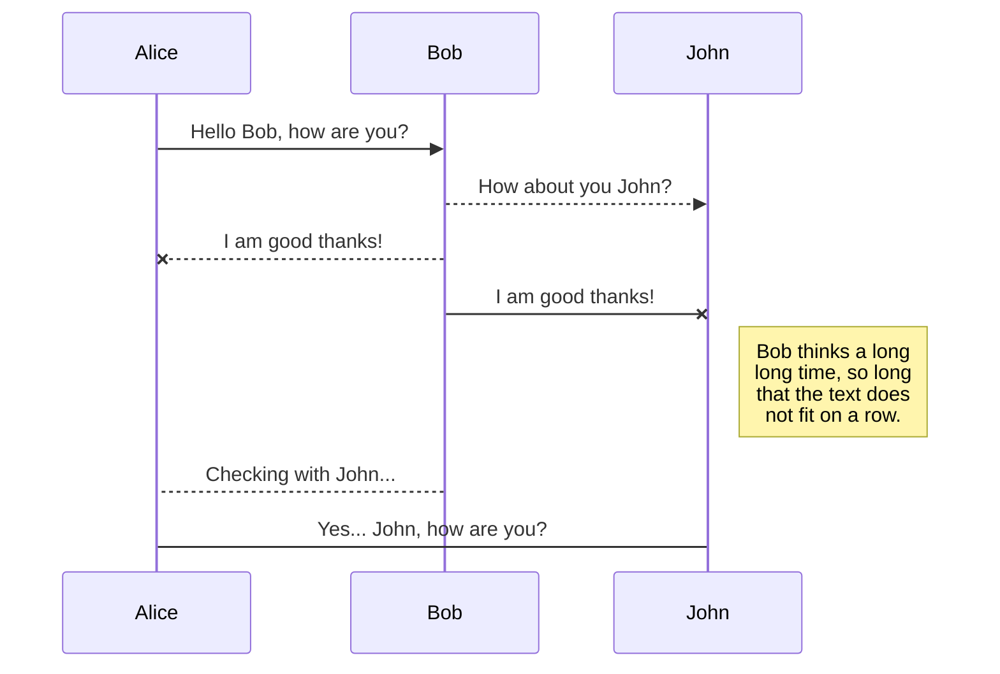
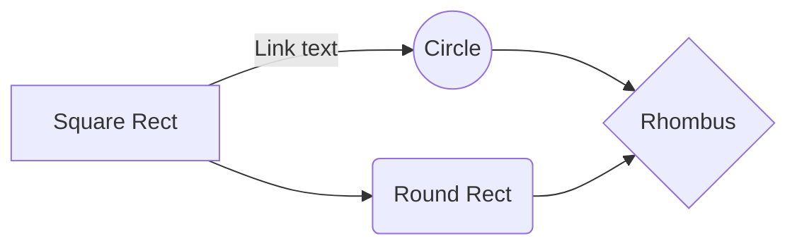

 
# The Football Report
This is website is part of the the Code Institute Full Stack Software Development course.. and is the final project of the course. It is the fourth project along the leaning curve and aimed to complete the course. The project represents a football newspaper site which allow page visitors to read a sample of free articles. If visitor register can have full access to the entire website articles. The next level of user experience an user subsription functionality which employ also the business logic of the project. By subscribing the user can  become an author by publishing an article with media. The subscription plan resembles a contribution that help the founders of the website to maintain and host the service.

The purpose of project is purely for educational usage although it provides readings that I personally wrote throught my hobby as freelance football writre. The payment system module is build with the test version of Stripe and it is for testing only. It does not process real payments. Tests of the payment can be performed with credit card number 4242 4242 4242 4242. Please visit https://stripe.com/docs/testing to find more about the test card details.

## Table of Contents

1.  [**User Experience**](#user-experience)
-  [**Project Goals**](#project-goals)
-  [**User Goals**](#user-goals)
-  [**User Stories**](#user-stories)
-  [**Design**](#design)
-  [**Wireframes**](#wireframes)

  
2.  [**Features**](#features)
-  [**Existing Features**](#existing-features)
-  [**Future Features**](#future-features)
3.  [**Database Schema**](#database)
4.  [**Technologies Used**](#technologies-used)
5.  [**Testing**](#testing)
6.  [**Coding Notes**](#coding-notes)
7.  [**Deployment**](#deployment)
8.  [**Acknowledgements**](#acknowledgements)
9.  [**Disclaimer**](#disclaimer)

# User Experience

All your files and folders are presented as a tree in the file explorer. 
You can switch from one to another by clicking a file in the tree.

## Project Goals

The project purpose is to build a Full Stack webiste to present the complete learning 
outcomes of the course. 
The project is submitte for evaluation and entails a pass grade to graduate with 
universite certified diploma. The website backend is built with Django Framework and Python and thanks to Django has backend database (SQLite). 

The website represents a football platform for analisys and creative writiting 
for author. Page visitors can read the sample of articles available. 
To access the full list of articles users have to registered which automatically 
create a profile page. Registered user can extend their experiece by writing 
and publishing their ownn articles. To publish an article needs to buy a 
subscription framed as a contribution purpose to keep the website going and 
paying for costs of hosting. The subscription logic uses small amounts to 
support the community support framing. To facilitate the e-commerce logic 
I will install Stripe which is payment processing software. 

### Target customers

People who love football as a sport and social event
People who like writing.
Freelance journalists

### User Stories

This website aims to provide the following:

1. Allow users to visit the page and have access to the sampled articles and media without being registered.
2. Non-registered users can view the about page, motivation page, landing page and pricing page. 
3. Provide users with signup option
4. After registration users has access to to the full webpage content
5. User have their own profile page with a default picture setup.
6. After logged in users are able to pick subscription plan, add it to their shopping card and submit a payment to become authors and publish their own articles.
7. Users have access to shorlist with their own articles and subscripton history in the profile page
8. After becoming authors, user are provided with option ot update and delete only their own aritcles.

## Design

### Wireframes

WIrefames serve as the blueprints of the website design. Wireframe are added 
\thanks to [https://balsamiq.com/](https://balsamiq.com/) tool recommended by 
the Code Institute. The blue prints and can be found in the [/documentation]() 
folder at  . As I was changing the project and style idea much before I 
choose this project all my blueprints were done on hand wiht pencil and paper 
and added after the page was coming though. During the proframming the style 
remaind the same with little changes, Some of the page desings were simplified 
in the final design changes to utilise space and better user interface on mobile.

### Responsive Design

The webisite is based on the Bootstrap front-end-framework availabel at[  
getbootstrap.com](https://getbootstrap.com/). 
Such framework allows to implement key design features and keep the them 
responsive on different screen sizes and mobile view. 
I used Firefox and Chrome for the programming part where the design 
stacked well eventually after constatly checking the devtools. 
The website is responsive on other browsers like Safari, Edge and Opera. 
It stack well mobile screens ranging between 320x568 to 414x736 
where the navigation bar shring to a hamburger dropdown menu .

### Colours

 ***#000***
 ***#a8a9ad*** 
 ***#f1f1f1***  
At the start of the project I used the defaul pure white background color for the body, later decided to switch to very light grey to reduce the lightning of the page and better visual relaxation for the user. The styling of the buttons follows the bootstrap4 color convention for danger, success, secondary and so forth.

###  Fonts and Icons

My choice for the 'Inter' (https://fonts.google.com/specimen/Inter?sidebar.open=true&selection.family=Interstems)
from the idea to be light and and not heavy for reading.
The icons form the Font Awesome library [fontawesome.com](https://fontawesome.com/). 
I tried to use as less as icons as possible in the desing because the website 
is focused and meant as writing platform that resembles a newspaper website. 
Using many icons would perceive the design style as more technical than it 
should be for these website types.

## Features

### Implemented Feautures

1. Landing page with image slide and inspirational video message.
2. Login and signup authnetication functionaliy
3. CRUD model so user can create, retreive, update and delete their Articles
4. User withe registered profiles can chosse subscription and author articles and take advantage fromt the CRUD model.

### Feautures To Implement In the Future

1. A start or score rating under each article 
2. Social media share buttons for the articles

## Database

During the development process the date is stored thanks to the Django builtin SQLite datebase. In the deployment phase the datebase is imported in Postrgres to reach to the production phase via Heroku.

### Datebase Schema

Here is my Database pattern, Thanks to this [advisory article](https://www.freecodecamp.org/news/how-to-create-database-schemas-quickly-and-intuitively-with-dbdesigner-2f4adf79a29d/) I used  https://www.dbdesigner.net/ to generate more clear and visual presentation of the datebase logic. 

# Technologies Used

To adopt and implemnt the features functuanalities this project employs Python, Django, Postgres, SQLite, HTML, CSS and JavaScript technologies.

-   [Python](https://www.python.org/)  The Django framework project active language  **Python 3.8**  is uded to develop the website.

-   [Unsplash API ](https://unsplash.com/) to generate the random photo gallery for the home page and the about page. The gallery theme is football.

-   [JQuery](https://jquery.com/) to make the video modal working and other responsive features like the navbar hamburger menu.
- 
-   [[CKEditor 5](https://ckeditor.com/ckeditor-5)  The project uses  **CKEditor 5**  as part of the Article model to make the text field better.
    
-   [Bootstrap 4](https://getbootstrap.com/)  to enhance website design responsivess over different screen sizes.
    
-   **HTML 5, CSS3 and JavaScript** are used throughout to improve the website structure and functionality.
    
-   [Google Fonts](https://fonts.google.com/)  to style the fonts.
    
-   [Django](https://www.djangoproject.com/)  The website is build from the  **Django**  framework.
    
-   [SQLite](https://www.sqlite.org/)  comes as built in feature in the Django Framework. It is used during the development phase
    
-   [Postgres](https://www.postgresql.org/)  The project utilizes **Postgres**  relational database to store database in the production phase.
    
-   [StackEdit](https://stackedit.io/)  used for building the readme file
    
-   [Stripe](https://www.stripe.com/)  facilitates the payments direclty from the page, 

-   [GitHub](https://github.com/) is the source code remote repository store the source code in a repository. The repository can be cloned or downloaded from here. Check  [Deployment]()  section

-   [Heroku](https://www.heroku.com) is used to host the project and make it available online with a original url.

-   [Amazon Web Services](https://aws.amazon.com/education/awseducate/) it comes after the delployment phase with Heroku. Hosting the website from Amazon Web Services' cloud is the last step of the deployment phase and brings the project in the production phase.

 ## Testing

The entire development process was had time contstraints and meeting deadlines. Hence I tested every new piece of code thourougly. 
When the submission version I perform some automated unit test and then a performance test report with the lighthouse feature in devtools for chrome.

### Automated Testing

Unit Test

| App Tested    | Test Info     | File Location | 
| ------------- | ------------- | --------------| 
| blog  | Testing the homepage view | blog/test_views.py  |
| blog |  Testing showing the articles list  | blog/test_views.py  |
| blog  | Testing click and view single article from the article list | blog/test_views.py  |
| blog  | Testing update  functuanalities  | blog/test_views.py  |
| blog  | Testing create new article functuanality  | blog/test_views.py  |
| blog  | Testing delete existing article functuanality  | blog/test_views.py|
| cart    | Test the login required to load the view_cart template| cart/test_views.py |
| cart    | Tests if the cart renders correctly after login | cart/test_views.py |
| checkout    | Tests if the form is validated correctly after correct user input | checkout/test_forms.py |
| checkout    | Tests if the form gives error feedback in case the user input is incorrect | checkout/test_forms.py  |
| profiles    | Tests if the signup page loads | profiles/test_views.py |
| profiles    | Tests if the login page loads | profiles/test_views.py |
| profiles    | Tests if the logout responds correctly | profiles/test_views.py |

Unit Test

The first report generated form the lighthouse tool showed some average results. After on each circle indicator the tool takes you
to the several points that may be causing the reduced results. Here is the first test tesults

image lighthouse3

Looking into the error I adjusted the width and height of the image in the info section of home.html. 
The second step was to remove redundant some JavaScript code. After this I added missing aria-labels
for all <button> tags. After this ended up with results which a bit better.

image lighthouse3

While taking into the account the score in the performance indicator I didn't plan to proceed with refactoring further because
the advice in the lighthouse tool indicated to remove the JQuery and some Stripe JavaScript code which is risky.

### Manual Testing

### Bugs & Workarounds
There are two types of synchronization and they can complement each other:

- The workspace synchronization will sync all your files, folders and settings automatically. This will allow you to fetch your workspace on any other device.
	> To start syncing your workspace, just sign in with Google in the menu.

- The file synchronization will keep one file of the workspace synced with one or multiple files in **Google Drive**, **Dropbox** or **GitHub**.
	> Before starting to sync files, you must link an account in the **Synchronize** sub-menu.

## Open a file

You can open a file from **Google Drive**, **Dropbox** or **GitHub** by opening the **Synchronize** sub-menu and clicking **Open from**. Once opened in the workspace, any modification in the file will be automatically synced.

## Save a file

You can save any file of the workspace to **Google Drive**, **Dropbox** or **GitHub** by opening the **Synchronize** sub-menu and clicking **Save on**. Even if a file in the workspace is already synced, you can save it to another location. StackEdit can sync one file with multiple locations and accounts.

## Synchronize a file

Once your file is linked to a synchronized location, StackEdit will periodically synchronize it by downloading/uploading any modification. A merge will be performed if necessary and conflicts will be resolved.

If you just have modified your file and you want to force syncing, click the **Synchronize now** button in the navigation bar.

> **Note:** The **Synchronize now** button is disabled if you have no file to synchronize.

## Manage file synchronization

Since one file can be synced with multiple locations, you can list and manage synchronized locations by clicking **File synchronization** in the **Synchronize** sub-menu. This allows you to list and remove synchronized locations that are linked to your file.

# Publication

Publishing in StackEdit makes it simple for you to publish online your files. Once you're happy with a file, you can publish it to different hosting platforms like **Blogger**, **Dropbox**, **Gist**, **GitHub**, **Google Drive**, **WordPress** and **Zendesk**. With [Handlebars templates](http://handlebarsjs.com/), you have full control over what you export.

> Before starting to publish, you must link an account in the **Publish** sub-menu.

## Publish a File

You can publish your file by opening the **Publish** sub-menu and by clicking **Publish to**. For some locations, you can choose between the following formats:

- Markdown: publish the Markdown text on a website that can interpret it (**GitHub** for instance),
- HTML: publish the file converted to HTML via a Handlebars template (on a blog for example).

## Update a publication

After publishing, StackEdit keeps your file linked to that publication which makes it easy for you to re-publish it. Once you have modified your file and you want to update your publication, click on the **Publish now** button in the navigation bar.

> **Note:** The **Publish now** button is disabled if your file has not been published yet.

## Manage file publication

Since one file can be published to multiple locations, you can list and manage publish locations by clicking **File publication** in the **Publish** sub-menu. This allows you to list and remove publication locations that are linked to your file.

# Markdown extensions

StackEdit extends the standard Markdown syntax by adding extra **Markdown extensions**, providing you with some nice features.

> **ProTip:** You can disable any **Markdown extension** in the **File properties** dialog.

## SmartyPants

SmartyPants converts ASCII punctuation characters into "smart" typographic punctuation HTML entities. For example:

|                |ASCII                          |HTML                         |
|----------------|-------------------------------|-----------------------------|
|Single backticks|`'Isn't this fun?'`            |'Isn't this fun?'            |
|Quotes          |`"Isn't this fun?"`            |"Isn't this fun?"            |
|Dashes          |`-- is en-dash, --- is em-dash`|-- is en-dash, --- is em-dash|

## KaTeX

You can render LaTeX mathematical expressions using [KaTeX](https://khan.github.io/KaTeX/):

The *Gamma function* satisfying $\Gamma(n) = (n-1)!\quad\forall n\in\mathbb N$ is via the Euler integral

$$
\Gamma(z) = \int_0^\infty t^{z-1}e^{-t}dt\,.
$$

> You can find more information about **LaTeX** mathematical expressions [here](http://meta.math.stackexchange.com/questions/5020/mathjax-basic-tutorial-and-quick-reference).

## UML diagrams

You can render UML diagrams using [Mermaid](https://mermaidjs.github.io/). For example, this will produce a sequence diagram:

And this will produce a flow chart:

This is the Code Institute student template for Gitpod. We have preinstalled all of the tools you need to get started. You can safely delete this README.md file, or change it for your own project. Please do read it at least once, though! It contains some important information about Gitpod and the extensions we use.

## Gitpod Reminders

To run a frontend (HTML, CSS, Javascript only) application in Gitpod, in the terminal, type:

`python3 -m http.server`

A blue button should appear to click: *Make Public*,

Another blue button should appear to click: *Open Browser*.

To run a backend Python file, type `python3 app.py`, if your Python file is named `app.py` of course.

A blue button should appear to click: *Make Public*,

Another blue button should appear to click: *Open Browser*.

In Gitpod you have superuser security privileges by default. Therefore you do not need to use the `sudo` (superuser do) command in the bash terminal in any of the lessons.

## Updates Since The Instructional Video

We continually tweak and adjust this template to help give you the best experience. Here is the version history:

**October 21 2020:** Versions of the HTMLHint, Prettier, Bootstrap4 CDN and Auto Close extensions updated. The Python extension needs to stay the same version for now.

**October 08 2020:** Additional large Gitpod files (`core.mongo*` and `core.python*`) are now hidden in the Explorer, and have been added to the `.gitignore` by default.

**September 22 2020:** Gitpod occasionally creates large `core.Microsoft` files. These are now hidden in the Explorer. A `.gitignore` file has been created to make sure these files will not be committed, along with other common files.

**April 16 2020:** The template now automatically installs MySQL instead of relying on the Gitpod MySQL image. The message about a Python linter not being installed has been dealt with, and the set-up files are now hidden in the Gitpod file explorer.

**April 13 2020:** Added the _Prettier_ code beautifier extension instead of the code formatter built-in to Gitpod.

**February 2020:** The initialisation files now _do not_ auto-delete. They will remain in your project. You can safely ignore them. They just make sure that your workspace is configured correctly each time you open it. It will also prevent the Gitpod configuration popup from appearing.

**December 2019:** Added Eventyret's Bootstrap 4 extension. Type `!bscdn` in a HTML file to add the Bootstrap boilerplate. Check out the <a href="https://github.com/Eventyret/vscode-bcdn" target="_blank">README.md file at the official repo</a> for more options.

--------

Happy coding!
